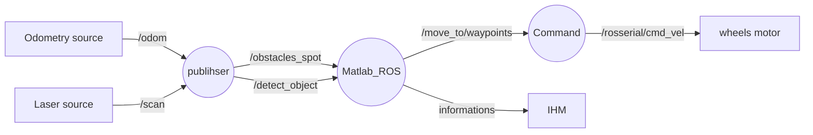
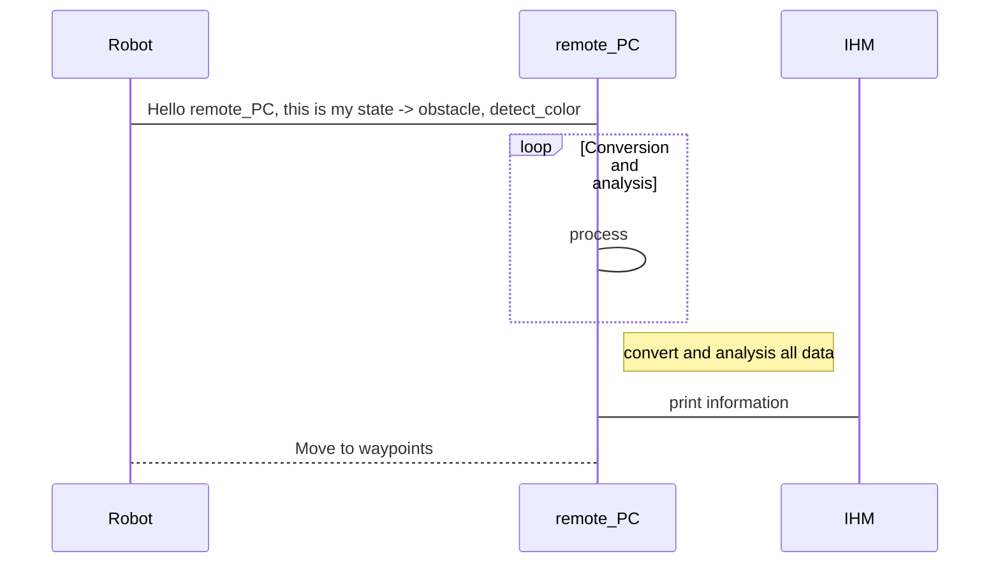

# Projet de majeure "Robotique de service"
s5_g7_briand_guy_kahan_martinez

<<<<<<< HEAD
**Auteurs:** 

- Estelle BRIAND
- Nicolas GUY
- Jeremie KAHAN
- Paul MARTINEZ

# Scenario 

Un robot doté d'une pince doit se déplacer vers une zone d'action "prise" où il devra reconnaitre une cannette de couleur (verte ou rouge) et la prendre à l'aide de sa pince. Il l'amenera ensuite à la zone d'action "depot" de couleur correspondante où il la déposera. 
A la fin de la tâche, le robot retourne à sa position initiale dans la zone de parking (couleur grise).

# Cahier des charges

Creer un environement de simulation et une raspberry_pi qui sera connectée au robot réel et ses capteurs afin de pouvoir plannifier son parcours, les étapes à suivre et effectuer des tâches définies.
Une IHM permettra de connaitre l'etat actuel du robot.

## Contraintes

- Pas de connection filaire ave le PC
- Vehicule doit être autonome sans contact visuel direct
- Connection avec une arduino, capteurs(lidar et IMU) et camera
- Doit être capable de reconnaitre des points d'interets et les actions associées

# Listes des fonctionnalités :

1. [ ] IHM
    1. [x] Affichage de la map
    2. [ ] Creation de la map
    3. [x] Affichage information de l'etat du robot
    4. [x] Affichage liste des commandes

2. [ ] ROS Matlab
    1. [x] Detection obstacles + emplacement selon les positions: (devant/derriere/gauche/droite)(utilisant le lidar)
    2. [x] hector_SLAM
    3. [ ] Mapping ?
    4. [ ] Algorithme du plus court chemin
    5. [ ] Ordre de déplacement 

4. [ ] Vision du robot
    1. [x] Detection d'objet "cannette"
    2. [ ] Detection de la couleur
    3. [ ] Calcule la distance de l'objectif

## Technologies utilisées:

- ROS (sur rapsberry pi)
    - rosserial --> arduino sur robot
    - dynamixel_motor --> controller moteur en position
    - rplidar_ros --> gestion du Lidar
    - hector_slam (simultaneous localization and mapping) --> gestion de la map 
- Matlab (sur PC)
    - ROS toolboxes
    - Mobile Robotics Simulation Toolbox
    - Calcul des trajectoires
- Vision (sur rapsberry pi)
    - reconnaissance cannettes
    - reconnaissance couleur
- Capteurs : Lidar & IMU

# Représentation des noeuds
> En cours de construction


# Description de l'algo
> En cours de construction


# Vidéos de présentation

[Lien vers la vidéo pitch youtube](url)

[Lien vers la vidéo tutoriel youtube](url)

# Liste des dépendances et pré-requis

- Raspberry pi 3 B
    - ubuntu 18.04
    - ROS
- Matlab 2020b
    - Robotics System Toolbox
    - ROS Toolbox
    - Simulink
    - Aerospace Toolbox
- rplidar A2 

# Mise en oeuvre
Suivre les [wikis](https://gitlab.com/20-21_5ETI_PRJ/Sujet_5__Simulated_robotic_scenario/s5_g7_briand_guy_kahan_martinez/-/wikis/home) (section wiki de gitlab) dans l'ordre suivant:
- Flasher une carte SD pour rapsberry pi 3B
- Etablir la connection ssh raspberry pi - ordinateur windows
- How to use SLAM with a RPLidar on RaspberryPi 3B+ using ROS

### Exemple de planning type


## Rendu par séances
Séance 1 du Lundi 04 Janvier 2021 matin :
- Jérémie : documentation et tests IHM Matlab
- Nicolas : Recherche documentation/codes capteurs IR/US + se replonger dans les codes servomoteur dynamixel AX12 du projet proto
- Paul : Documentation et entrainement 
- Estelle : Installation ubuntu mate + ROS sur raspberry, verifier le bon fonctionnement --> difficultés rencontrées avec la version 20, essai avec rasperry pi OS (debian)

Séance 2 du Lundi 04 Janvier 2021 après-midi :
- Jérémie : documentation liens Simulink-IHM Matlab et généralités sur les Digital Twins, découverte des toolboxes associées
- Estelle : Installation & tests ubuntu-mate-18.04.2-beta1-desktop-armhf+raspi-ext4.img 

Séance 3 du Mardi 05 Janvier 2021 matin :
- Jérémie : Mise au point objectifs du projet, matériel et documentation Toolboxes Matlab
- Paul : Debut entrainement à la reconnaissance d'objet, canette/couleur & test materiel
- Estelle: test du matériel et flash des cartes SD des autres raspberry. Deux raspberry (pi3 et pi4) operationnelles.
carte SD de 16G / 64G / 128G prêtes + documentation

Séance 5 du Lundi 11 Janvier 2021 matin :
- Paul : Detection d'objet avec l'internal software du pixy2. Voir pour l'utlisation des coordonnées des box et installation des dependances pour rasberry. https://docs.pixycam.com/wiki/doku.php?id=wiki:v2:hooking_up_pixy_to_a_raspberry_pi
=======
**Auteurs:** Estelle BRIAND_Nicolas GUY_Jeremie KAHAN_Paul MARTINEZ

# Useful Documentation

https://medium.com/robotics-with-ros/installing-the-rplidar-lidar-sensor-on-the-raspberry-pi-32047cde9588

https://www.youtube.com/watch?v=Qrtz0a7HaQ4

https://www.youtube.com/watch?v=qNdcXUEF7KU&ab_channel=RoboticsWeekends

http://smartroom.metz.supelec.fr/ArchiveCartoTurtlebot/Projet_turtlebot.html

| Goal | Status |
| ------ | ------ |
| Mapping Lidar | DONE |
| Ultrason RaspberryPi | DONE |
| Communication IHM/Lidar | Doing |
| IMU | TODO |

# ---------------------------------------------------------------------------------------
# Tuto: How to implement a RPLidar on RaspberryPi 3B+ using ROS

##### Robot Project - CPE Lyon 2020 / 2021
###
### Created by Nicolas Guy on Mon 11/02/2021


This tutorial will show you how to implement a RPLidar on a RasberryPi 3B+ using ROS. All the test have been done on Ubuntu 18.04 and ROS Kinetic. 

Setting used:
  - Ubuntu 18.04
  - ROS Kinetic
  - Catkin

### What is a RP Lidar ?
> RPLIDAR is a low cost 2D LIDAR solution developed by RoboPeak Team, SlamTec company. It canscan 360° environment within 6 meter radius. The output of RPLIDAR is very suitable to build map, do slam, or build 3D model.

### First step how to connect the RPLidar ?

Find a micro USB Cable and stick it in the USB port. Then connect the "5 cables" from the Lidar to the microcontroller hub. Finally, connect the USB cable to the RaspberryPi 3B+.

### Prepare your Ros Worspace and package

### Installation

```sh 
mkdir rplidar_ws
cd rplidar_ws
mkdir src
cd src
sudo git clone https://github.com/Slamtec/rplidar_ros.git
cd ~/rplidar_ws/
catkin_make
```
The build can take a lot of time, be patient and don't do anything during the catkin_make

After that, you have to source your bashrc with this command
```
source devel/setup.bash
```

### Activate the serial USB port

You need to activate the serial USB port of your RaspberryPi 3B+ for being able to connect the Lidar via USB. To do this your need to write the command:

```
sudo chmod 666 /dev/SERIAL_USED
```

To find the serial you are using you can use this command below. Most of the time it is ttyUSB0

```
ls -l /dev|grep ttyUSB
```

### Time to run the Lidar:

You just have to run the launcher you downloaded on the github from Slamtec and you should have your first mapping. (It is preferable to start a roscore on another terminal before)

    roslaunch rplidar_ros view_rplidar.launch
    
  - rpllidar_ros is the package
  - view_rplidar.launch is the launcher

At this point you should have Rviz running, the Lidar moving and your first mapping on Rviz.

# ---------------------------------------------------------------------------------------

#  Tuto: How to use SLAM with a RPLidar on RaspberryPi 3B+ using ROS

This tutorial is going to show you how to use SLAM with a RPLidar connected to a RaspberryPi 3B+ and ROS to have a better mapping of the environment. 

##### Robot Project - CPE Lyon 2020 / 2021
###
### Created by Nicolas Guy on Mon 11/02/2021

Setting used:
  - Ubuntu 18.04
  - ROS Kinetic
  - Catkin
  - RaspberryPi 3B+

### Have a look to the topic /scan

>To manage to do it you need to have completed the tutorial: How to implement a RPLidar on RaspberryPi 3B+ using ROS)

Let's first have a look to the topics that we have when we launch the view_rplidar.launch. To do that, open a terminal and go on your rplidar workspace. (It is preferable to start a roscore on another terminal before)

```
source devel/setup.bash
roslaunch rplidar_ros view_rplidar.launch
```

Open an other terminal, and use the rostopic echo command to see the topics used. The one that interest us the most is the /scan topic

```
rostopic echo /scan
```

You should see a bunch of numbers. If you press ctrl+C it will stop the rostopic echo process and it will be easier to see the data. The most important informations you should see are:

- angle_min
- angle_max
- time_increment
- angle_increment
- scan_time
- range_min
- range_max
- ranges

The most important one is ranges. it is a list of data which correspond to the coordinates the detected objects. To see just this list you can have the command:

```
rostopic echo /scan/ranges
```

### Setting SLAM using ROS

To manage to use SLAM with the Rplidar we will use a project already made by hector_slam, all credits goes to him: https://github.com/tu-darmstadt-ros-pkg/hector_slam

You need to go on your /src folder of your workspace and git clone the project

```
git clone https://github.com/tu-darmstadt-ros-pkg/hector_slam.git
```

 We will have to modify some launchers of the hector_slam package to run it with our RPlidar. SLAM is working with predefined topics and referentials we common have on a robot and in our case we will have to modify them because it is not the case for us. 
 
 > First go on the folder hector_slam/hector_mapping/launch/mapping_default.launch
 
 In this launchfile, SLAM is working as if the base frame was the base_footprint topics but it is not the case for us, it is the base_link. Also the same for the odom_frame. So we have to change three lines (the 5th, the 6th and the 57th lines).  
 
```
  <arg name="base_frame" default="laser"/>
  <arg name="odom_frame" default="laser"/>
  <node pkg="tf" type="static_transform_publisher" name="base_to_laser_broadcaster" args="0 0 0 0 0 0 map nav 100"/>
```

> Then we need to go on a second launchfile hector_slam/hector_slam_launch/launch/tutorial.launch
> In this launchfile you just have to change the use_sim_time into false. It means we are not in simulation anymore but in real life. 

```
<param name="/use_sim_time" value="false"/>
```

### Run SLAM with the RPlidar 

On one terminal launch this launchfile with this command (don't forget to source devel/setup.bash)
```
roslaunch rplidar_ros rplidar.launch
```

On a second terminal launch this launchfile with this command (don't forget to source devel/setup.bash)
```
roslaunch hector_slam_launch tutorial.launch
```

You should have your RPlidar working and the mapping being done on Rviz. 

# ---------------------------------------------------------------------------------------


### More Informations:

| Website | Link |
| ------ | ------ |
| RPLidar/RaspberryPu | https://medium.com/robotics-with-ros/installing-the-rplidar-lidar-sensor-on-the-raspberry-pi-32047cde9588|
| Youtube Video to implement an RPLidar | https://www.youtube.com/watch?v=Qrtz0a7HaQ4 |
| Youtube video to see an exemple of Lidar with SLAM | https://www.youtube.com/watch?v=qNdcXUEF7KU&ab_channel=RoboticsWeekends|
| Github project RPi - IMU | https://github.com/pcdangio/ros-driver_mpu9250 |
# ---------------------------------------------------------------------------------------------
>>>>>>> dev_guy
