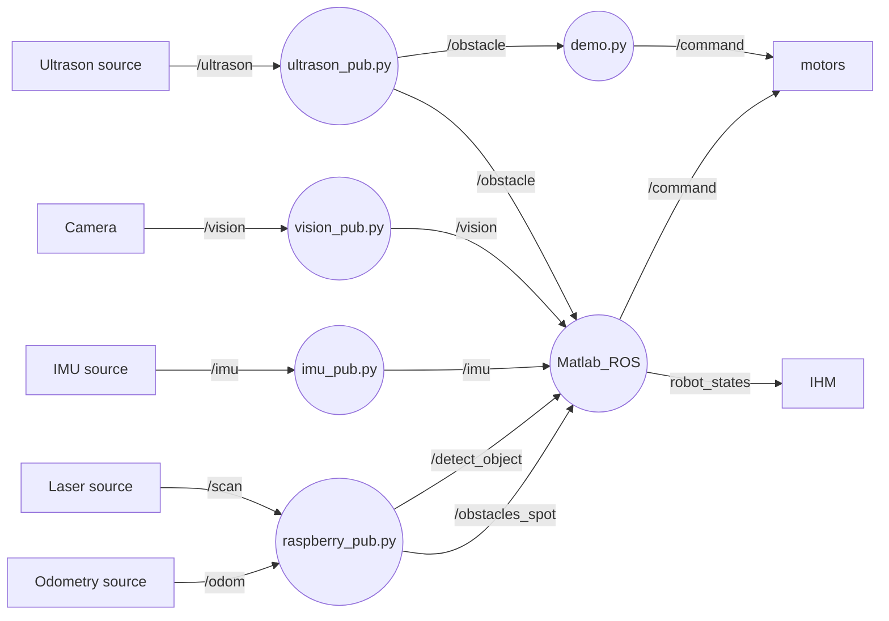
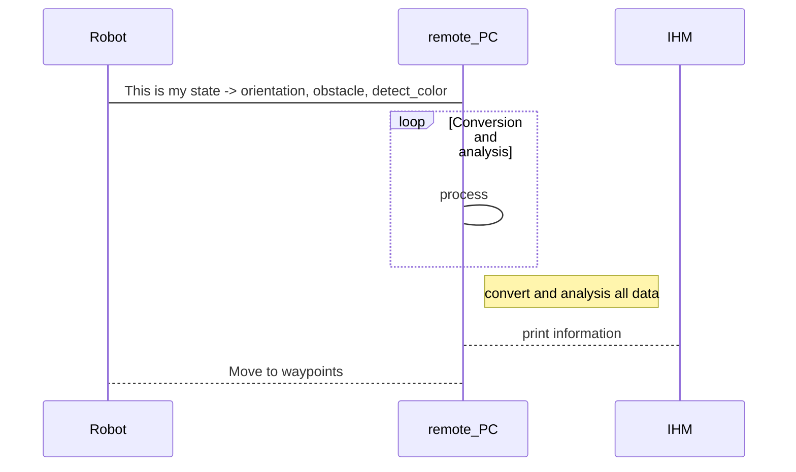

# Projet de majeure "Robotique de service"
s5_g7_briand_guy_kahan_martinez

[Lien vers la visualisation 3D](https://gitlab.com/20-21_5ETI_PRJ/Sujet_5__Simulated_robotic_scenario/s5_g7_briand_guy_kahan_martinez/-/blob/master/stl_dir/Assemblage_STL.STL)

**Auteurs:** 

- Estelle BRIAND
- Nicolas GUY
- Jeremie KAHAN
- Paul MARTINEZ

# Scenario 

Un robot doté d'une pince doit se déplacer vers une zone d'action "prise" où il devra reconnaitre une cannette de couleur (verte ou rouge) et la prendre à l'aide de sa pince. Il l'amenera ensuite à la zone d'action "depot" de couleur correspondante où il la déposera. 
A la fin de la tâche, le robot retourne à sa position initiale dans la zone de parking (couleur grise).

# Cahier des charges

Creer un environement de simulation et une raspberry_pi qui sera connectée au robot réel et ses capteurs afin de pouvoir plannifier son parcours, les étapes à suivre et effectuer des tâches définies.
Une IHM permettra de connaitre l'etat actuel du robot.

# Image du prototype final du projet

## Contraintes

- Pas de connection filaire ave le PC
- Vehicule doit être autonome sans contact visuel direct
- Connection avec une arduino, capteurs(lidar et IMU) et camera
- Doit être capable de reconnaitre des points d'interets et les actions associées

# Listes des fonctionnalités :

1. [x] IHM
    1. [x] Affichage de la map
    2. [x] Creation de la map
    3. [x] Affichage information de l'etat du robot (orientation, vitesse, map)
    4. [x] Affichage liste des commandes de creation de la carte
    5. [x] Affichage position obstacle

2. [ ] ROS Matlab
    1. [x] Detection obstacles + emplacement selon les positions: (devant/derriere/gauche/droite)(utilisant le lidar)
    2. [ ] hector_slam
    3. [ ] Mapping
    4. [X] Algorithme du plus court chemin
    5. [x] Ordre de déplacement 
    6. [x] Recuperer information IMU

3. [ ] Navigation
    1. [x] Implémentation Lidar et mapping (type RPLidar)
    2. [x] Mapping réalisé sous ROS_SLAM avec le lidar
    3. [x] Implémentation capteur Ultrason et détection de distance
    4. [x] Implémentation IMU permettant de connaitre le Pitch/Yaw/Roll du robot
    5. [X] Optimisation de la centrale inertielle (valeur plus fiable et correction erreur)
    6. [X] Assemblage des différents capteurs entre eux pour la navigation globale du robot
    7. [ ] Evitement d'obstacle autonome (local planner)

4. [x] Vision du robot
    1. [x] Detection d'objet "cannette"
    2. [x] Detection de la couleur
    3. [x] Calcule la distance de l'objectif

## Technologies utilisées:

- ROS (sur rapsberry pi)
    - rosserial --> arduino sur robot
    - dynamixel_motor --> controller moteur en position
    - rplidar_ros --> gestion du Lidar
    - hector_slam (simultaneous localization and mapping) --> gestion de la map 
- Matlab (sur PC)
    - ROS toolboxes
    - Mobile Robotics Simulation Toolbox
    - Calcul des trajectoires
- Vision (sur rapsberry pi)
    - reconnaissance cannettes
    - reconnaissance couleur
- Capteurs :
    - RPLidar (SLAMTEC)
    - MPU9250
    - HC-SR04 ultrasonic sensor 

# Représentation des noeuds
> Noeuds actuels

# Description de l'algo
> En cours de construction

# Vidéos de présentation

[Lien vers la vidéo pitch youtube](https://youtu.be/T0i_Y2brrEU)

[Lien vers la vidéo tutoriel youtube](https://youtu.be/lP1sIUkGzPA)

# Liste des dépendances et pré-requis

- Raspberry pi 3 B
    - ubuntu 18.04
    - ROS
    - rosserial
    - python-smbus
- Matlab 2020b
    - Robotics System Toolbox
    - ROS Toolbox
    - Simulink
    - Aerospace Toolbox

# Mise en oeuvre
Suivre les [wikis](https://gitlab.com/20-21_5ETI_PRJ/Sujet_5__Simulated_robotic_scenario/s5_g7_briand_guy_kahan_martinez/-/wikis/home) (section wiki de gitlab) dans l'ordre suivant:
- Flasher une carte SD pour rapsberry pi 3B
- Etablir la connection ssh raspberry pi - ordinateur windows
- How to implement a HC SR04 ultrasonic sensor on a RaspberryPi using ROS 
- How to implement a MPU9250 on a RaspberryPi 
- How to implement a RPLidar on RaspberryPi 3B using ROS 
- How to use SLAM with a RPLidar on RaspberryPi 3B using ROS 

### Exemple de planning type

