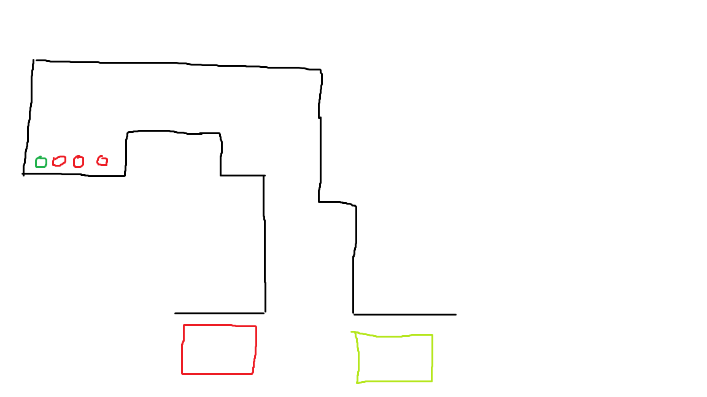
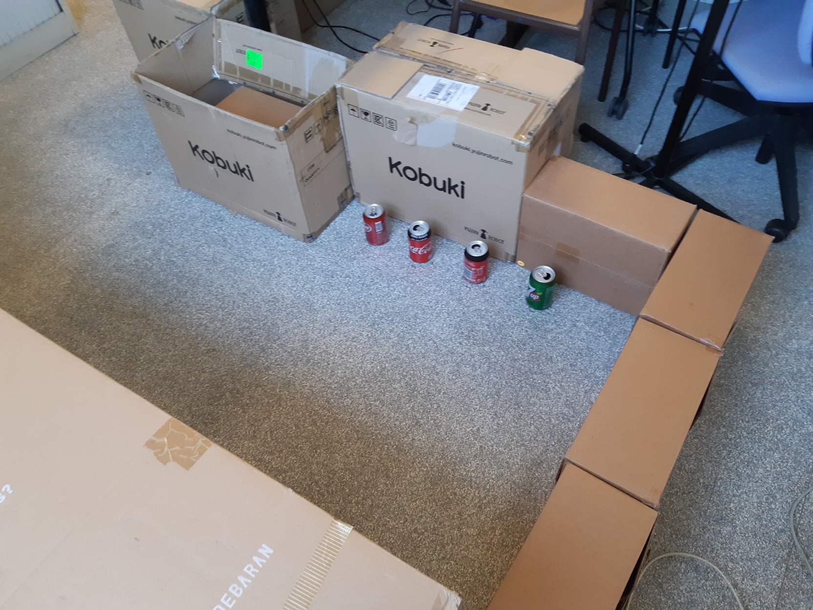

# Projet de majeure "Robotique de service"
s5_g7_briand_guy_kahan_martinez - BRANCH: dev_briand

**Auteur:** Estelle BRIAND

# Branch BRIAND

-> work on the ROS, Integration of communication

## Work in progress:
- [X] Dynamixel :  dans le workspace ROS /projet_ws  pour le controle du dynamixel en position
- [ ] ROS serial : dans le workspace ROS /projet_ws pour le la liaison serial entre arduino uno et raspberry
- [X] ROS network :  on veut une connection ethernet entre la raspberry et matlab
- [x] Installation OS: Ubuntu-mate 18.04
- [x] Installation ROS sur Ubuntu-mate : melodic de preference
- [ ] Definir besoin pour matlab et ros
- [ ] Creation du workspace final
- [ ] script fusion

--> rapsberry pi prête : 2
# Important
## Les consignes du concours:

La map pourrait ressembler à ça:

Il doit reconnaitre les cannettes de couleurs rouge et verte

## Robot (class)

Le robot sera stocké en tant qu'objet. Il aura differentes propriétés et méthodes.

### Proprieté

- Obstacle --> Dictionnaire qui retourne un bool pour les position 'devant / derriere / gauche /droite"
- Scan --> les donnée brut venant du lidar

### Methode
- is_obstacle('position') --> renvoie un booleen

# How to
- flash_sd_card --> raspberry_pi/flash_sd_card.md
- Connection raspberry pi - matlab

## Researchs and links

https://yoraish.com/2020/01/23/a-full-autonomous-stack-a-tutorial-ros-raspberry-pi-arduino-slam/

http://di.univ-blida.dz:8080/jspui/bitstream/123456789/2889/1/R%C3%A9alisation%20d%E2%80%99un%20Robot%20mobile%20avec%20%C3%A9vitement%20d%E2%80%99obstacle%20et%20atteinte%20un%20objectif%20fix%C3%A9.pdf

tuto ubuntu + ros: https://medium.com/@rishabhdevyadav/install-ubuntu-mate-18-04-and-ros-on-raspberry-pi-3-b-7ff84688fa37
