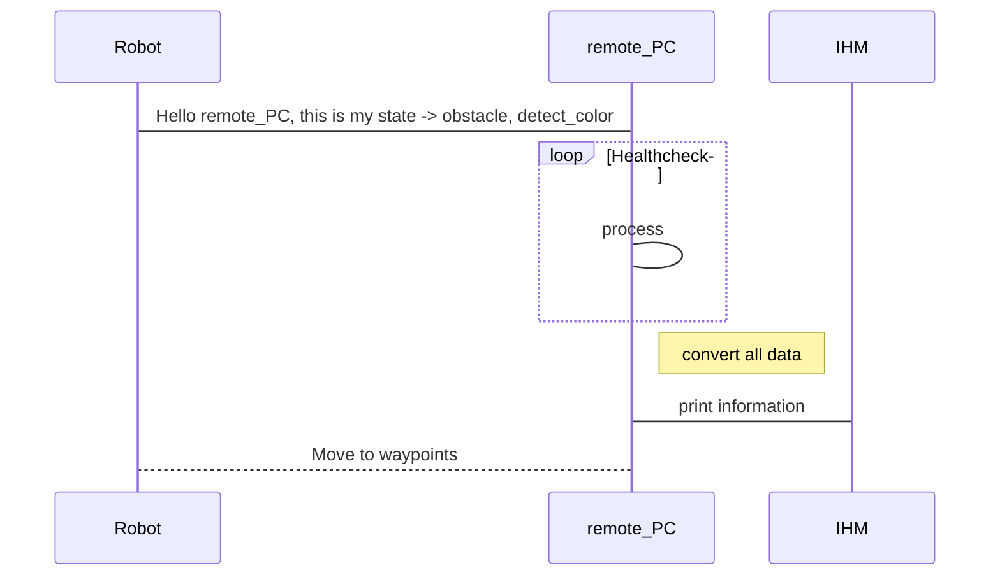

# Projet de majeure "Robotique de service"
s5_g7_briand_guy_kahan_martinez

**Auteurs:** 

- Estelle BRIAND
- Nicolas GUY
- Jeremie KAHAN
- Paul MARTINEZ

## Scenario 

Un robot doté d'une pince doit se déplacer vers une zone d'action "prise" où il devra reconnaitre une cannette de couleur (verte ou rouge) et la prendre à l'aide de sa pince. Il l'amenera ensuite à la zone d'action "depot" de couleur correspondante où il la déposera. 
A la fin de la tâche, le robot retourne à sa position initiale dans la zone de parking (couleur grise).

# Cahier des charges

Creer un environement de simulation et une raspberry_pi qui sera connectée au robot réel et ses capteurs afin de pouvoir plannifier son parcours, les étapes à suivre et effectuer des tâches définies.
Une IHM permettra de connaitre l'etat actuel du robot.

## Contraintes

- Pas de connection filaire ave le PC
- Vehicule doit être autonome sans contact visuel direct
- Connection avec une arduino, capteurs(lidar et IMU) et camera
- Doit être capable de reconnaitre des points d'interets et les actions associées

# Listes des fonctionnalités :

1. [ ] IHM
    1. [x] Affichage de la map
    2. [ ] Creation de la map
    3. [x] Affichage information de l'etat du robot
    4. [x] Affichage liste des commandes

2. [ ] ROS Matlab
    1. [x] Detection obstacles + emplacement selon les positions: (devant/derriere/gauche/droite)(utilisant le lidar)
    2. [x] hector_SLAM
    3. [ ] Mapping ?
    4. [ ] Algorithme du plus court chemin
    5. [ ] Ordre de déplacement 

4. [ ] Vision du robot
    1. [x] Detection d'objet "cannette"
    2. [ ] Detection de la couleur
    3. [ ] Calcule la distance de l'objectif

## Technologies utilisées:

- ROS (sur rapsberry pi)
    - rosserial --> arduino sur robot
    - dynamixel_motor --> controller moteur en position
    - rplidar_ros --> gestion du Lidar
    - hector_slam (simultaneous localization and mapping) --> gestion de la map 
- Matlab (sur PC)
    - ROS toolboxes
    - Mobile Robotics Simulation Toolbox
    - Calcul des trajectoires
- Vision (sur rapsberry pi)
    - reconnaissance cannettes
    - reconnaissance couleur
- Capteurs : Lidar & IMU

# Représentation des noeuds
> En cours de construction

# Description de l'algo
> En cours de construction

# Vidéos de présentation

[Lien vers la vidéo pitch youtube](url)

[Lien vers la vidéo tutoriel youtube](url)

# Liste des dépendances et pré-requis

- Raspberry pi 3 B
    - ubuntu 18.04
    - ROS
- Matlab 2020b
    - Robotics System Toolbox
    - ROS Toolbox
    - Simulink
    - Aerospace Toolbox
- rplidar A2 

# Mise en oeuvre
Suivre les [wikis](https://gitlab.com/20-21_5ETI_PRJ/Sujet_5__Simulated_robotic_scenario/s5_g7_briand_guy_kahan_martinez/-/wikis/home) (section wiki de gitlab) dans l'ordre suivant:
- Flasher une carte SD pour rapsberry pi 3B
- Etablir la connection ssh raspberry pi - ordinateur windows
- How to use SLAM with a RPLidar on RaspberryPi 3B+ using ROS

### Exemple de planning type

## Rendu par séances
Séance 1 du Lundi 04 Janvier 2021 matin :
- Jérémie : documentation et tests IHM Matlab
- Nicolas : Recherche documentation/codes capteurs IR/US + se replonger dans les codes servomoteur dynamixel AX12 du projet proto
- Paul : Documentation et entrainement 
- Estelle : Installation ubuntu mate + ROS sur raspberry, verifier le bon fonctionnement --> difficultés rencontrées avec la version 20, essai avec rasperry pi OS (debian)

Séance 2 du Lundi 04 Janvier 2021 après-midi :
- Jérémie : documentation liens Simulink-IHM Matlab et généralités sur les Digital Twins, découverte des toolboxes associées
- Estelle : Installation & tests ubuntu-mate-18.04.2-beta1-desktop-armhf+raspi-ext4.img 

Séance 3 du Mardi 05 Janvier 2021 matin :
- Jérémie : Mise au point objectifs du projet, matériel et documentation Toolboxes Matlab
- Paul : Debut entrainement à la reconnaissance d'objet, canette/couleur & test materiel
- Estelle: test du matériel et flash des cartes SD des autres raspberry. Deux raspberry (pi3 et pi4) operationnelles.
carte SD de 16G / 64G / 128G prêtes + documentation

Séance 5 du Lundi 11 Janvier 2021 matin :
- Paul : Detection d'objet avec l'internal software du pixy2. Voir pour l'utlisation des coordonnées des box et installation des dependances pour rasberry. https://docs.pixycam.com/wiki/doku.php?id=wiki:v2:hooking_up_pixy_to_a_raspberry_pi
