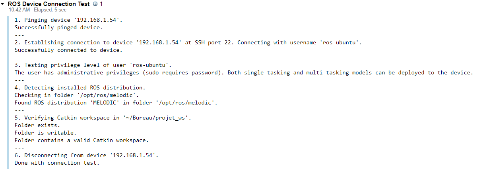

# Objectifs

Le but est de se connecter à la raspberry via la wifi afin de lancer les nodes et recevoir les informations, topics et service venant de celle ci et de lui en renvoyé.

# Connaitre les adresses IP des deux appareils
## rapsberry pi:

```shell
ifconfig
hostname -I
```
Ensuite il faut mettre à jour le fichier ~/.bashrc pour que ROS connaisse l'adresse IP de l'host.

```shell
echo export ROS_MASTER_URI=http://localhost:11311 >> ~/.bashrc
echo export ROS_HOSTNAME=192.168.X.54 >> ~/.bashrc
```
## PC windows

Utiliser un terminal ubuntu (linux kernel). Vous pouvez en télécharger un dans le windows store:


```shell
estelle@DESKTOP-K3CV3BK:~$ ifconfig
eth2:  ...

wifi0: flags=4163<UP,BROADCAST,RUNNING,MULTICAST>  mtu 1500
        inet 192.168.1.29  netmask 255.255.255.0  broadcast 192.168.1.255
        inet6 fe80::8034:3ba2:65ee:72c9  prefixlen 64  scopeid 0xfd<compat,link,site,host>
        ether 9c:da:3e:9c:8f:c9  (Ethernet)
        RX packets 0  bytes 0 (0.0 B)
        RX errors 0  dropped 0  overruns 0  frame 0
        TX packets 0  bytes 0 (0.0 B)
        TX errors 0  dropped 0 overruns 0  carrier 0  collisions 0
...
```

On obtient par example :

PC : 192.168.1.29
raspberry pi : 192.168.1.54

## Test ssh
1. Sur Windows (terminal):

```shell
estelle@DESKTOP-K3CV3BK:~$ ping 192.168.1.54

PING 192.168.1.54 (192.168.1.54) 56(84) bytes of data.
64 bytes from 192.168.1.54: icmp_seq=1 ttl=64 time=130 ms
64 bytes from 192.168.1.54: icmp_seq=2 ttl=64 time=44.4 ms
```

# Matlab
## Sur simulink:

Cliquer sur "Apps-->Robot Operating System(ROS)"
choisir le premier ROS
Il faut à présent configurer le réseau et l'accès au workspace de notre projet. Selectionner "remember my password" pour faciliter la connection à l'avenir.


Faites un test, vous deviez avoir les ligne suivantes:


Si problème de connection, reportez vous à la section "Problèmes possibles", un peu plus bas.

# ROS connection
## Raspberri pi
Creer un workspace

```shell
mkdir -p catkin_ws/src
cd catkin_ws
catkin_make
source devel/setup.bash
```

Lancer un ROSCORE
```shell
roscore
```
## Matlab
Dans l'editeur classique matlab, lancer l'initialisation du noeud rosmatlab et entrée l'adresse IP de la raspberry pi:

```matlab
rosinit("192.168.1.54")
```

# Problèmes possibles

## La raspberry ne repond pas au ping sur windows:
"connection bloqué par l'utilisateur":
cela peut etre du au firewall sur la rasbberry.
Pour supprimer toute les règles et partir sur les règles par défaut:
```
sudo iptables -F
```
https://vitux.com/how-to-block-allow-ping-using-iptables-in-ubuntu/

## Connection impossible:
Il se peut que les clef ssh ne soient pas configurer sur la rapberry pi. Pour corriger cela:

```shell
/etc/init.d/ssh stop
sudo /etc/bin/ssh-keygen -A
/etc/init.d/ssh start
sudo systemctl status ssh
```
# liens
https://www.technig.com/network-ubuntu-and-windows-10/
http://wiki.ros.org/turtlebot/Tutorials/indigo/Network%20Configuration#External_references